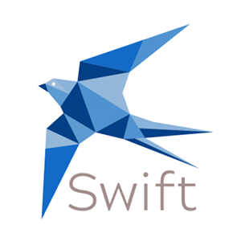

# Swift

<p align="center">
  
</p>

Meet Swift. Fast video meetings make simple.

Swift is a minimal, cross-platform web application for fast and simple video conferencing.

## Running the server

1. Clone this repo
```bash
git clone https://github.com/Andrea-Dispe/Swift-server
```
2. Install the dependencies
```bash
npm install
```
3. In the root, create a .env file with these environment variables - FIXME

4. Run docker - FIXME

5. Enjoy!

PS - the server has been deployed on Heroku!
[Heroku](http://fathomless-eyrie-92787.herokuapp.com/)
[GraphQL endpoint](http://fathomless-eyrie-92787.herokuapp.com/graphql)

## Built with
* [ExpressJS](https://expressjs.com/)
* [Apollo GraphQL](https://www.apollographql.com/docs/)
* [Sequelize ORM](https://sequelize.org/)
* [Typesript](https://www.typescriptlang.org/)
* [PeerJS](https://peerjs.com/) - For peer to peer communication
* [Socket.io](https://socket.io/) - A Node.js library for realtime web communications
* [Docker](https://www.docker.com/) - Container management
* [Heroku](https://www.heroku.com/) - Server deployment
* Powered by caffeine (and sometimes 🍷 🍻)

## Made by
* Andrea Disperati - [Github](https://github.com/Andrea-Dispe) - [LinkedIn](https://www.linkedin.com/in/andrea-dispe/) 🇮🇹 🇨🇳
* Justin Patterson - [Github](https://github.com/ajustinpatterson) - [LinkedIn](https://www.linkedin.com/in/ajustinpatterson/) 🇺🇸 🇪🇸
* Mo Wong - [Github](https://github.com/ommwong) - [LinkedIn](https://www.linkedin.com/in/mowong1) 🇺🇸 🇫🇷


